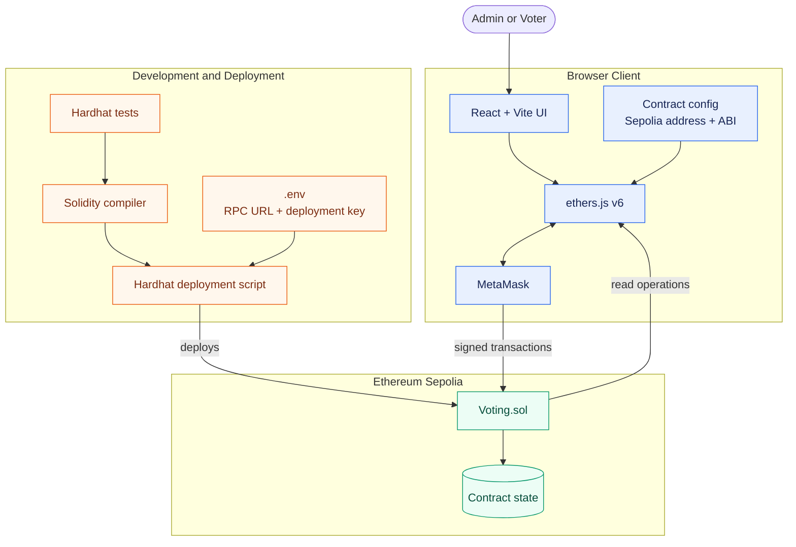

# BlockBallot

A simple decentralized voting DApp. Administrators register voters and candidates; registered voters cast one on-chain vote using MetaMask.

## Features

- MetaMask wallet connection with Sepolia network checks
- Admin-only voter and candidate registration
- One vote per registered voter
- Live candidate vote counts and current winner
- Transaction loading, success, and error feedback

## Architecture

React frontend → ethers.js v6 → MetaMask → `Voting.sol` on Ethereum Sepolia.



## Tech stack

- React, Vite, JavaScript, CSS
- Solidity, Hardhat, ethers.js v6
- MetaMask and Ethereum Sepolia

## Project structure

```text
BlockBallot/
├── frontend/       # React DApp
└── blockchain/     # Solidity contract, tests, deployment script
```

## Local setup

```bash
git clone <repository-url>
cd BlockBallot
cd blockchain && npm install
cd ../frontend && npm install
```

## Environment variables

Copy the example files before adding your own values. Never commit `.env` files.

```bash
cp blockchain/.env.example blockchain/.env
cp frontend/.env.example frontend/.env
```

- `SEPOLIA_RPC_URL`: Sepolia JSON-RPC endpoint
- `PRIVATE_KEY`: funded deployment-wallet private key
- `VITE_VOTING_CONTRACT_ADDRESS`: deployed Sepolia `Voting` contract address

## Smart contract commands

Run tests:

```bash
cd blockchain
npm test
```

Compile:

```bash
npm run compile
```

Deploy locally:

```bash
npm run deploy:local
```

Deploy to Sepolia after configuring `blockchain/.env`:

```bash
npm run deploy:sepolia
```

Copy the printed deployment address into `frontend/.env` as `VITE_VOTING_CONTRACT_ADDRESS`.

## Frontend

```bash
cd frontend
npm run dev
```

Build for production:

```bash
npm run build
```

## Voting flow

1. The deployer is the contract admin.
2. The admin registers voters and candidates.
3. A registered voter connects MetaMask on Sepolia and votes once.
4. The frontend refreshes candidate counts and the current winner after confirmation.

## Known limitations

- The contract has no election start/end dates or voter identity verification.
- Tied results return the first candidate with the highest count.
- The frontend requires a deployed Sepolia address before it can interact with a contract.
